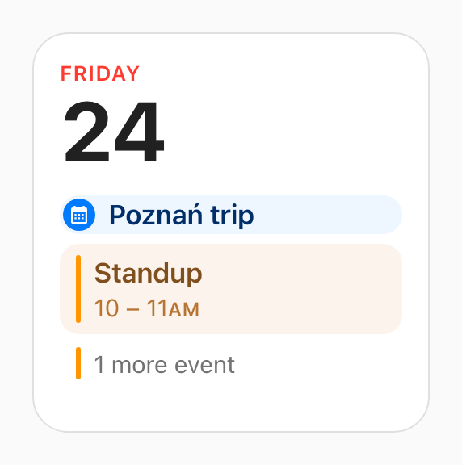
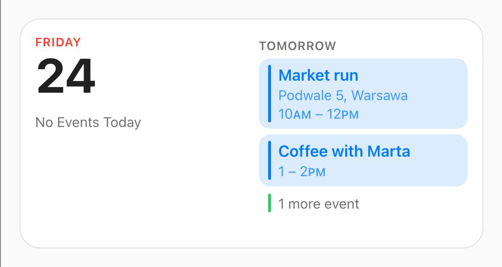
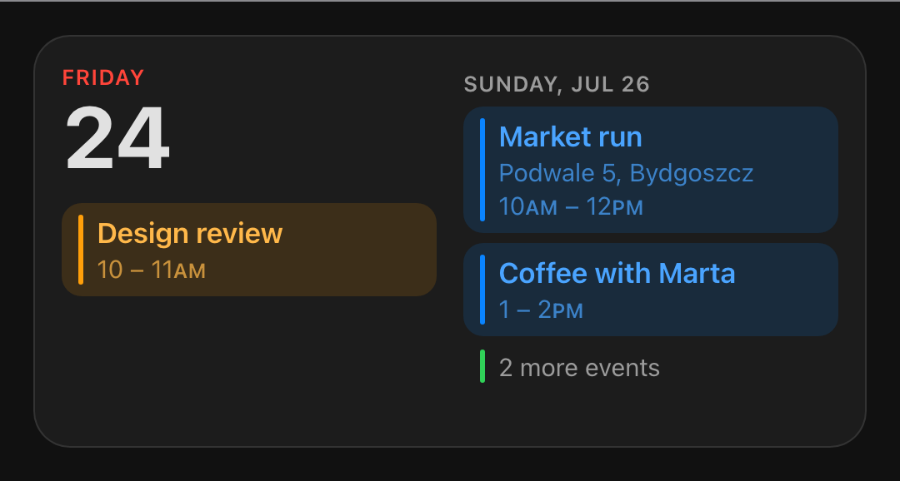

# Cupertino Widgets

Widget cards for Home Assistant dashboards, styled like the ones on a phone's home screen.
Install, drop a card on a dashboard, done — the cards pick sensible defaults instead of
asking you to fill in a config, and they take their shape from the box you drag them into
rather than from a size setting you have to think about.

**[Try the cards in your browser →](https://sabbaken.github.io/cupertino-widgets/)** Every
size, live, with sample data and the clock under your control — and the config to paste when
you like what you see. Nothing to install.

> **Status: early.** The calendar card draws your real calendars and lays itself out exactly
> like the phone's. It is the only card there is so far, and the grey reminder rows are not
> wired up yet — those need `todo` entities.

Requires a current Home Assistant, **2026.7 or newer** — the cards track the latest frontend
APIs rather than carrying compatibility shims.

## The calendar

Today's date, then today's events, then as much of the days after today as the card has
room for — one continuous flow, poured through however many columns the footprint gives it.
Each event is tinted with the colour of the calendar it came from. Empty days are not listed
as empty, they simply do not appear, and whatever is left of the day the card ran out of
room in becomes `2 more events`.

<table>
  <tr>
    <td align="center" valign="top" width="50%">
      
      <br />
      <sub><b>Medium.</b> A full day, then tomorrow. <code>Dentist</code> is still today —
      the flow simply ran out of left column.</sub>
    </td>
    <td align="center" valign="top" width="50%">
      
      <br />
      <sub><b>Small.</b> Today and nothing else, ever. The badge is an all-day event, which
      has no time to show and so gets a row to itself.</sub>
    </td>
  </tr>
  <tr>
    <td align="center" valign="top">
      
      <br />
      <sub><b>A quiet day.</b> Nothing today, so it says so — and rather than leave the
      other column empty as well, the flow starts there with tomorrow.</sub>
    </td>
    <td align="center" valign="top">
      
      <br />
      <sub><b>Dark theme.</b> It follows the one you picked in Home Assistant. Tomorrow is
      empty here, so it is skipped — and the heading becomes a date, because
      <code>TOMORROW</code> has to mean literally tomorrow.</sub>
    </td>
  </tr>
</table>

Those are fixtures rather than anybody's real week. What the card decides to show, and in
what order, is written down in
[`docs/calendar-widget-rules.md`](docs/calendar-widget-rules.md) — down to why `5 – 6PM`
prints only one `PM`.

## Install

### HACS

Add this repository as a custom repository of type **Dashboard**, then download it.
HACS registers the dashboard resource for you.

### Manually

1. Download `cupertino-widgets.js` from the
   [latest release](../../releases/latest) into `config/www/`.
2. Add it under **Settings → Dashboards → ⋮ → Resources** as
   `/local/cupertino-widgets.js`, type **JavaScript module**.

## Adding a card

Pick **Cupertino Calendar** from the dashboard's card picker and set it up there — it has a
visual editor, so there is no YAML to write. Three fields: **Calendars**, which calendars
feed it; **Clock**, which format it prints times in; and **Scale**, how large to draw it.
Leave all three alone and you get every calendar, your Home Assistant time format, and 100%.

The equivalent YAML, if you prefer it:

```yaml
type: custom:cupertino-widgets-calendar
entities: # optional; leave it out for every calendar
  - calendar.work
  - calendar.personal
time_format: system # optional; system | 12 | 24
scale: 100 # optional; 80–130, percent
```

| Option        | Default        | Meaning                                                         |
| ------------- | -------------- | --------------------------------------------------------------- |
| `entities`    | every calendar | Which `calendar.*` entities to draw. Omit it rather than empty. |
| `time_format` | `system`       | `system` follows your profile; `12` or `24` overrides it.       |
| `scale`       | `100`          | Percent. Draws the whole widget larger or smaller. 80–130.      |

`12`, `24` and `scale` are read whether or not you quote them.

**On `system`.** It follows the time format in your Home Assistant profile, and that
setting's own auto-detection reads the browser's locale — which is the only channel a
browser offers. A Mac set to AM/PM behind a browser set to British English detects 24-hour
and there is no web API that would know better. That is what `12` and `24` are for.

Colours come from the colour set on each calendar in Home Assistant's entity settings, and
otherwise from this library's own palette, dealt in the same order Home Assistant's own
calendar panel deals its own — so a calendar keeps the colour you have got used to. Each
calendar is subscribed to rather than polled, so the card follows Home Assistant as events
change.

## How big it is

**There is no size option.** Resize the card the normal way — the **Layout** tab in the
dashboard editor — and it works out which of the two widget shapes fits the box you gave it:
the square shows today, and the wider 2:1 shows today and what follows it. The line is at
340px of card — roughly 9 of the 12 columns in a section of the usual width — and it moves
with `scale`, because larger type needs more room before two columns of it stop truncating
every title.

| footprint       | comes out at  | shape            |
| --------------- | ------------- | ---------------- |
| **6 × 4** rows  | ~246 × 248 px | the small square |
| **12 × 4** rows | ~500 × 248 px | the medium 2:1   |

Everything between and around them works too — that is the whole point of measuring the box
instead of reading a preset. A card dragged taller fills the extra height with more rows
rather than leaving it blank, and one dragged narrow folds to a single column. But those two
are the proportions the content was laid out for. A new card arrives full width and 4 rows
tall, and can be dragged down to 4 columns by 3 rows — which is the date and a couple of
events, and where turning `scale` down earns its keep.

**`scale` is the other question.** The footprint settles how much room the card has; `scale`
settles how large what goes in it is drawn — the type at 80% or 130% of the size above,
along with the spacing around it, for a wall tablet read from across the room or a dense
dashboard read at a desk. One factor over the whole widget, so the card at 120% is the card
at 100% seen from closer up rather than a differently proportioned one.

It is spent out of the row budget, which is the trade worth knowing about. The same
footprint that holds 4 rows under the date and 7 in the second column at 100% holds 2 and 5
at 130%, and 6 and 9 at 80% — so a card scaled up wants dragging taller, and a card scaled
down fills the height it already has with more of the day. Values outside 80–130 are clamped
rather than refused.

The Layout tab writes its footprint into `grid_options`, which is Home Assistant's own and
belongs to every card rather than to this one.

## The widgets

| Widget                          | Status                |
| ------------------------------- | --------------------- |
| Calendar                        | events, live          |
| Reminders, in the calendar card | needs `todo` entities |
| Battery levels                  | planned               |
| To-do lists                     | planned               |

## Support the project

The cards are free and will stay that way. If one has earned its place on your dashboard and
you feel like saying thanks:

**[Buy me a coffee](https://buymeacoffee.com/sabbaken)** ·
**[Ko-fi](https://ko-fi.com/sabbaken)**

## Development

`pnpm dev` serves the showcase with no Home Assistant needed, `pnpm test` runs the layout
rules as unit tests. [`docs/development.md`](docs/development.md) has the rest: the two
loops, how the screenshots are generated, and where everything lives.

## Licence

[GNU Affero General Public License v3.0](LICENSE) (`AGPL-3.0-only`).
