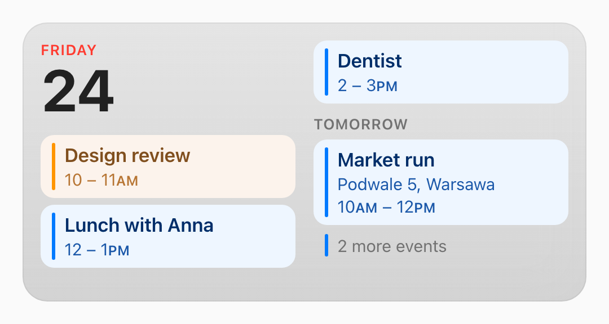
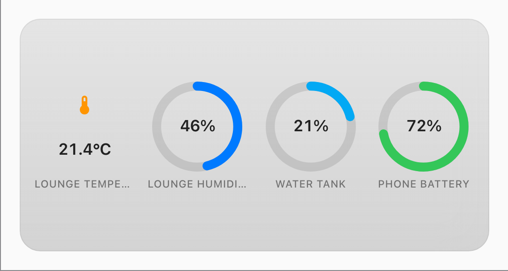
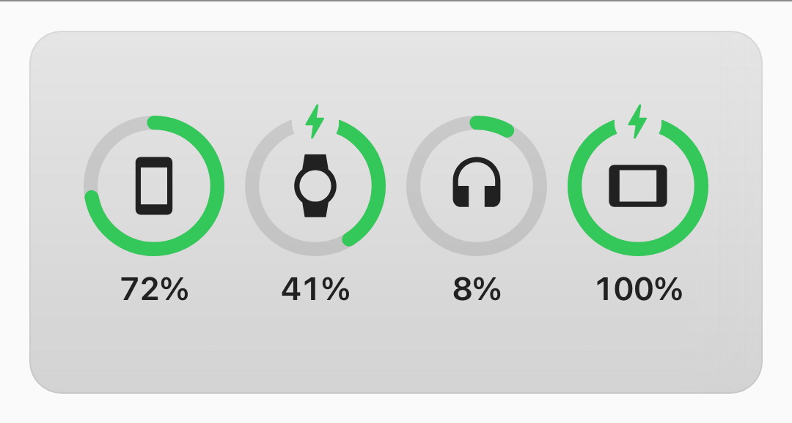
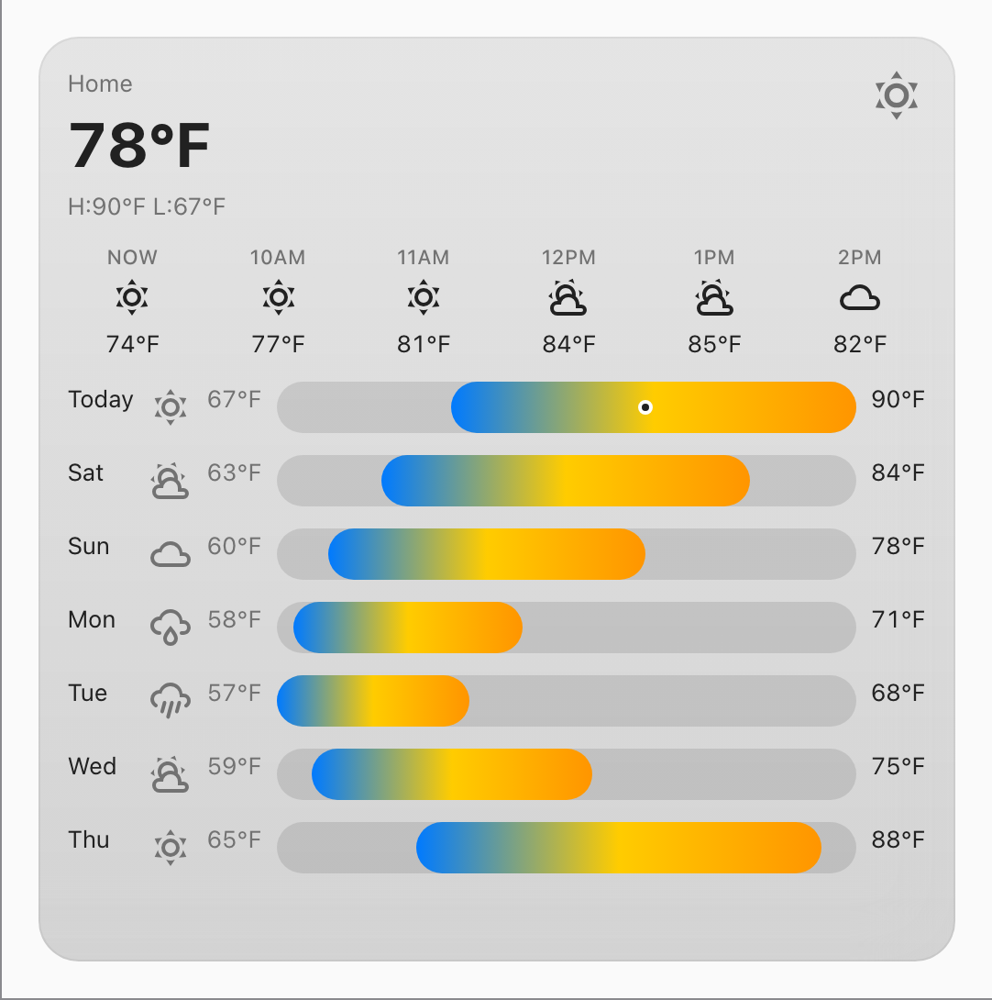
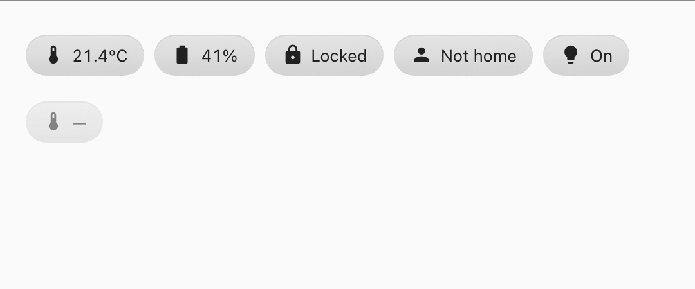
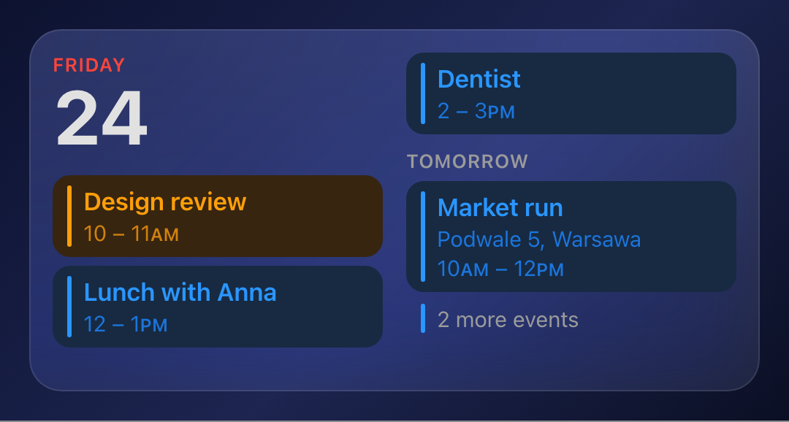

# Cupertino Plus

Widget cards for [Home Assistant](https://www.home-assistant.io/) dashboards, styled like the
ones on a phone's home screen: sensible defaults instead of a config to fill in, and a shape
taken from the box you drag them into rather than from a size setting.

**[Install](#install)** · **[The cards](#the-cards)** · **[Configuring](#configuring)** ·
**[Development](docs/development.md)**

[](https://github.com/64bitjoe/cupertino-plus/actions/workflows/ci.yml)
[](./LICENSE)
[](https://www.home-assistant.io/)

> **A fork.** This is a fork of
> [sabbaken/cupertino-widgets](https://github.com/sabbaken/cupertino-widgets) by
> **Kirill Verenih**, who wrote the calendar and battery cards and everything they stand on.
> The complication, weather, chips and tiles cards are the additions here. Same AGPL-3.0 licence, and
> the original copyright notice travels with every build.

It needs a current Home Assistant, **2026.7 or newer**: the cards track the latest frontend
APIs rather than carrying compatibility shims.

## Install

**HACS.** Add this repository as a custom repository of type **Dashboard**:

```
https://github.com/64bitjoe/cupertino-plus
```

Then install **Cupertino Plus** and reload your browser.

**Manually.** Download `cupertino-plus.js` from the
[latest release](https://github.com/64bitjoe/cupertino-plus/releases), drop it in
`config/www/`, and add it under **Settings → Dashboards → Resources** as a JavaScript module:

```
/local/cupertino-plus.js
```

## The cards

Six of them. Each one is in the card picker; none of them needs YAML.

### The calendar

Today's date, then today's events, then as much of the days after today as the card has room
for, one continuous flow poured through however many columns the footprint gives it. Each
event is tinted with the colour of the calendar it came from, and anything due out of your
to-do lists joins the same flow at its own time. Empty days simply do not appear.

<p align="center">
  
</p>

Every decision it makes is written down in
[`docs/calendar-widget-rules.md`](docs/calendar-widget-rules.md).

### The complications

Any entity, drawn the way a watch face draws one. Point it at one entity or several, pick a
style, and it works out the rest: the name, the icon, the unit, the colour, and whether there
is a range worth drawing an arc against.

<p align="center">
  
</p>

Five styles: **circular** (a ring gauge), **rectangular**, **rectangular with header**,
**rectangular full-bleed**, and **inline** (a single strip that stacks into a list).

Two things it does that are worth knowing before you use it. The ring is simply not drawn
when the entity has no honest range to measure — a room's temperature has no ceiling, and an
arc against an invented one would be a fraction of nothing — so that face shows the icon and
the reading instead. And the colour comes from _what the entity measures_ and then holds
still; it never moves with the value, because a colour that stepped with the number would
just be a second, blurrier opinion about a number the gauge has already given you.

The rules, including the contrast work behind the coloured faces, are in
[`docs/complication-widget-rules.md`](docs/complication-widget-rules.md).

### The batteries

A ring per device, green all the way, with the level read off the length of the arc and a
bolt on whatever is charging. Point it at the battery sensors you care about and it works out
how many rings across, whether there is room for the percentages, and how big to draw them.

<p align="center">
  
</p>

The rules are in [`docs/battery-widget-rules.md`](docs/battery-widget-rules.md).

### The weather

One entity, and everything else follows from it. Current conditions first, then the next six
hours starting from right now rather than from whatever hour the forecast happens to begin at,
and — give the card enough room — the week beyond them, each day drawn as a low, a range bar
and a high. The bars all share one scale, the width of the whole week rather than of the one
day under it, so a warm day sits visibly to the right of a cold one instead of every bar
running the full width of its own row and telling you nothing next to its neighbours.

<p align="center">
  
</p>

The high and low printed under the current temperature come from the forecast, never from the
entity's own attributes — there is no such attribute to read — so even the smallest card, which
draws neither the hourly strip nor the daily list, still holds a subscription open for it. Night
is mostly a guess the card makes for itself: Home Assistant marks only one condition,
`clear-night`, as explicitly after dark, so every other glyph's day-or-night choice comes from
`sun.sun`'s actual position for the current hour and a plain clock for every hour after it,
because a sun's position is a snapshot and a forecast is not.

The rules, including why the bars are never scaled against themselves, are in
[`docs/weather-widget-rules.md`](docs/weather-widget-rules.md).

### The chips

A row of small pills, one per entity, each of them a press away from doing something. This is
the Lock Screen family rather than the Home Screen one: no card behind it by default, no colour
of its own, just one ink and a translucent scrim floating on your dashboard. A chip shows a
glyph and its entity's reading, or the glyph alone, or a small caption stacked over the
reading — and whichever of those you pick, every chip in the card draws at the same height, so
the row reads as one band rather than as a ragged line.

<p align="center">
  
</p>

A press opens more-info by default, and per chip it can toggle, navigate to another view, call
a service, or be turned off entirely — a chip that does nothing is drawn as a chip that does
nothing, with no button role and no tab stop. The row wraps onto a second line rather than
hiding a chip, and the card asks Home Assistant for exactly the height that takes: it arrives
with the Layout tab's **Auto height** on, so it sits at the height of its chips with no strip of
empty dashboard under it, and nothing to set in `grid_options`. Put it over a busy
wallpaper and the translucency has nothing predictable behind it; `container: card` is the
answer, and gives the pills an ordinary card surface to sit on.

The rules, including the two containers and what a press can be made to do, are in
[`docs/chips-widget-rules.md`](docs/chips-widget-rules.md).

### The tiles

A wrapping grid of small rounded tiles, one per shortcut, each a glyph, a name and a line of
state. This is the Home Screen family where the chips are the Lock Screen one: a tile is a
coloured object rather than a mark in one ink, so it tints itself from what its entity is (a
thermometer orange, a lock red, a scene purple) and a `color` of your own overrides that. At
rest the colour is in the glyph, and the tile fills with it on hover or press; `wash: always`
keeps every tile filled. Tiles share their row's width equally, so a row fills its section edge
to edge, and wrap only when a tile would fall below 96 units: four across a section of about
410px or more, three on a phone. There is no column count to keep in step with a box you can
drag. To keep each row on one line however narrow the card, set `flow: row` (**Rows: One line
per row** in the editor): the tiles narrow to share the line instead, their names ellipsizing,
and a `break` still starts a new row. Like the chips, the card is exactly as tall as its tiles
(Auto height in the Layout tab) unless you drag it to a row count of your own, in which case the
tiles sit at the top of the taller box.

<p align="center">
  
</p>

A tile does not need an entity: with a name, an icon and a `navigate` press it is a shortcut
to another view, and leaves its state line empty (a dash there is kept for an entity that is
not reporting). Name, icon, colour, state and
visibility can each be a template. A press opens more-info by default on a tile with an
entity (one without defaults to no action), and per tile can
toggle, navigate, call a service, or do nothing.

The rules, including why tiles carry a colour where chips refuse one, are in
[`docs/tiles-widget-rules.md`](docs/tiles-widget-rules.md).

## Configuring

Every card has a visual editor — add it from the picker and fill in the form. Nobody needs to
write YAML, and there is no size field in any of them: **Home Assistant's Layout tab owns the
footprint**, and the card re-lays itself out for whatever box you drag it into. The chips and
tiles cards are the exception that proves it: they default to Auto height, so their footprint is
their content until you drag one.

The six types, if you do want to paste config:

| Card         | Type                                 | Asks for                                    |
| ------------ | ------------------------------------ | ------------------------------------------- |
| Calendar     | `custom:cupertino-plus-calendar`     | nothing — it finds your calendars           |
| Complication | `custom:cupertino-plus-complication` | entities, and a style                       |
| Battery      | `custom:cupertino-plus-battery`      | which battery sensors                       |
| Weather      | `custom:cupertino-plus-weather`      | one weather entity                          |
| Chips        | `custom:cupertino-plus-chips`        | entities, and what a press on each one does |
| Tiles        | `custom:cupertino-plus-tiles`        | which shortcuts, and what each one opens    |

Every card also takes `scale`, a percentage of the size it was designed at, for dashboards
being read from across a room.

And every card takes `container` (**Background** in the editor), and every card defaults to
`glass`, so a dashboard of them reads as one material out of the box. The chips and tiles float
on the dashboard; the calendar, battery, complication and weather cards draw the same
translucent glass as a tile, as a panel with its inset intact. Set `container: card` on any of
them for your theme's own card instead, which is what the four panel cards drew by default up
to v1.16.

<p align="center">
  
</p>

## Development

`pnpm install && pnpm dev` serves the showcase — every card against a mock Home Assistant,
with no install needed. See [`docs/development.md`](docs/development.md) for the full loop,
and [`docs/ha-api-notes.md`](docs/ha-api-notes.md) for what has actually been verified
against the frontend rather than assumed.

## Licence

[AGPL-3.0-only](./LICENSE). Copyright © 2026 Kirill Verenih, with modifications © 2026
Joe Speakman. If you run a modified version where other people can reach it, the licence
asks you to offer them the source.
