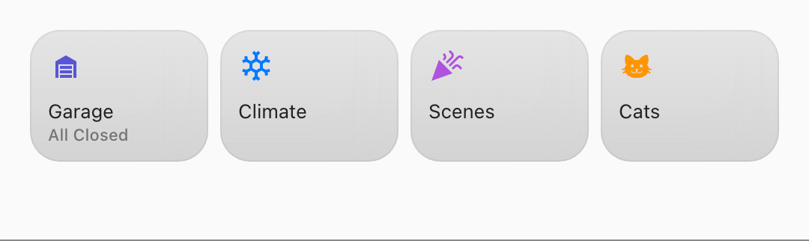

# Tiles widget: the rules

One card, a grid, and the premise the chips card refuses: a tile is not a mark on somebody
else's wallpaper, it is an object on a Home Screen. Point it at some entities and it draws one
small rounded tile each: a glyph, a name, a line of state, and a press that goes somewhere.
This is the specification the card implements; the code follows it module by module, and
`src/cards/tiles/*.test.ts` pins the worked cases below.

Read [`chips-widget-rules.md`](chips-widget-rules.md) first. This card is its sibling and
adopts most of it: the row reading, the templates, the press, the two containers and the
wrapping arithmetic are the chips card's, imported rather than copied. Where this document says
"unlike a chip", that is the sentence being paid for. The design it was built from is
[`docs/superpowers/specs/2026-09-07-tiles-card-design.md`](superpowers/specs/2026-09-07-tiles-card-design.md);
where the two disagree, this document describes what shipped.

<p align="center">
  
</p>

---

## 1. What a tile is

```ts
{
  entityId: string | undefined, // identity, and what a press acts on; undefined for §4
  name: string,         // drawn, unlike a chip's name in two of its three modes
  icon: string,         // an `mdi:` name; `mdi:apps` when nothing says otherwise
  picture: string | undefined, // an entity_picture, drawn in the glyph's place
  value: string,        // the state line; an em dash for nothing to read
  color: string | undefined,   // a resolved CSS value: the glyph, and a wash behind it
  unavailable: boolean,
  visible: boolean,     // whether the tile is drawn at all
  break: boolean,       // this tile starts a new row
  action: ActionConfig  // what a press does; see §6
}
```

`model.ts` is the whole of the card's contact with Home Assistant, the same split every other
card in the library makes: everything downstream draws a `TileView` and knows nothing about
entities. What a row _is_ (an entity or none, a bare string or an object, templates in the same
five fields) is the chips card's question and `model.ts` asks it by importing the chips model's
own functions. What differs is what a tile draws. It always draws icon, name and state, so
there is no `content`; it already shares its row's width (§2), so there is no `fill`; and an entity-less tile is a
navigation tile rather than a spacer.

A tile is a Home Screen object, and that one sentence decides most of what follows. A chip is
one ink on a wallpaper; a tile is a coloured thing with a name on it, sitting among its peers.

## 2. The grid, and why it wraps

**Tiles share their row and wrap.** The tiles in a row divide its width equally, so a row fills
its section edge to edge as Apple Home's does, and a line wraps only when one more tile would
push every tile below its minimum width: four across a section of about 410px or more, three on
a phone, reflowing rather than cramping. There is no `columns:` setting.

That is not the obvious choice, since Home Assistant's own grid card takes a column count, so it
is worth saying why. A `columns: 4` card dragged narrow gives four cramped tiles; a wrapping
one gives two rows of two. The card already knows how wide it is, and a number the user has to
keep in sync with a width they can drag is a number that will be wrong. It is also the
arrangement the chips card reached after four releases of getting the arithmetic wrong, and
reusing that code is worth more than matching a convention.

The arithmetic is `core/wrapping.ts`, shared with chips and generic over "a thing with a
width". Every tile is priced at its minimum width, which is the degenerate case of the chips card's
content-priced one rather than a second function: a stretched tile is wider only because the
line had room to spare, so the line count at the minimum is the line count the grid draws. Every detail in that module was earned by a
bug (the width comes from the measurement, a container's inset is told rather than assumed),
and writing them out again from memory is how they come back. `break: true` works exactly as
chips' §2a describes, with the same three rules: it says where a row starts rather than that it
fits, it is ignored on the first tile, and it is not templatable.

**A tile is at least 96 units wide, and 88 tall.** The spec guessed a fixed 112 by 96 and asked
the first render to settle it. The render settled the height; the first live dashboard settled
the width.

- **The width** was a fixed 112 in v1.13.0, and in the user's glass column of about 425 three
  fitted and the fourth wrapped alone beside a third of a column of nothing. It is now a
  minimum, pinned from both sides. Four across must fit that column with room to spare
  (4 × 96 + 3 × 8 = 408), and four across must fit a 500px section in card mode inside its two
  16-unit insets (468), which 112 never did. Below it a name stops reading: the name gets the
  tile less its two 12-unit paddings, 72 at the minimum, which holds "Hall Lamp" and "Front
  Door" at footnote size and ellipsizes "Living Room", with the whole name in the tooltip. That
  is only at the wrap point itself; at 425 a tile is 100 and "Living Room" reads whole.
- **Every row shares one set of columns.** Each row is a CSS grid of equal tracks no narrower
  than the minimum, capped at as many columns as the card's longest row has tiles. The cap is
  what fills the line: four tiles in a 640 column are four tiles of 154, not four of six
  narrower columns with a hole beside them. The tracks are what keep the grid a grid: a forced
  row of one under a row of four, or the last line of a wrapped row, takes one column of the
  rows above it rather than stretching across the card. A card of two tiles in a wide column
  does make two wide tiles; that is the row being shared, which is what was asked for.
- **The height** comes from the sections grid rather than from taste. A grid row is 56 with an
  8 gap, so two lines of 88-tall tiles are 184, which is exactly three rows, and one line inside
  the card container's two 16-unit insets is 120, which is exactly two. At 96 both spilled into
  one more row: a glass card of two lines asked for four rows and left 48px of dashboard empty
  under it. And 88 is not cramped: the glyph still clears the name by nine pixels, and the
  glyph-top, text-bottom split reads as two groups.

The floor is two tiles across rather than the chips card's three, because a tile is about twice
a chip's width and a floor of three would make the narrowest reachable card wider than many
sections: five grid columns on glass, six in card mode. Like the chips card's it is priced from the measured width once there is one,
and the card asks Home Assistant for exactly its own content height.

## 3. Colour: a tile has an identity

**A tile tints itself from what its entity is, and a per-tile `color` overrides that.**

This is the chips card's §3 turned over, and on purpose. That rule says a chip opts out of
identity because a Lock Screen accessory is a mark in one ink, and the argument is good and is
about the Lock Screen. A Home Screen tile is the opposite object: the thing that _carries_ an
identity. It is why the four hand-coloured cards this one replaces were each their own colour,
and why nobody configured them that way one at a time.

The order is: the tile's own `color`, then the card's `color`, then `tintFor` in
`core/tint.ts`: temperature orange, lock red, light yellow, the rest by device class and domain,
as the complication card has always done. Chips never call it, and that is what keeps them
monochrome. The colour paints the glyph and a wash behind it, in the chips card's three cases:
light glass, dark glass lit from the top edge, and card mode mixed into the opaque track. The
name and the state line stay one ink, for the reason the complication card gives about colour
that moves with a value.

Two things differ from a tinted chip, both found in the first render rather than argued in
advance:

- **The wash is lighter, about two thirds of a chip's weights.** The chip's alpha was tuned
  for a small pill; over a tile's six-times-larger area it made a grid of eight a wall of pastel
  in light and of brown and olive slabs in dark, with the ground competing with the glyph for
  the colour. Two thirds keeps every tile identifiable at a glance and leaves the glyph to
  carry the hue.
- **A `scene` tints purple, on tiles only.** `tintFor` answers `accent` for a scene, which under
  Home Assistant's default theme is a light blue, and the first render put a scene tile beside
  a person and a climate shortcut as a third blue tile. A scene is also the commonest thing in
  a shortcut grid, and the Scenes card this replaces was purple. The override is a small table
  in the tiles model; `core/tint.ts`'s shared one is unchanged, so the complication card still
  draws a scene as it did.

**An unavailable tile drops its colour**, like every other card here. The dimming is the signal,
and a crisp tint undercuts it.

## 4. Templates, and a tile with no entity

Both are the chips card's, adopted rather than re-argued (see
[`chips-widget-rules.md`](chips-widget-rules.md)). `name`, `icon`, `color`, `value` and `show`
may each be a template, a string holding `{{` or `{%`, resolved through the shared
subscription pool. `{{ config.entity }}` is in scope, so one template serves every tile.
The card-level `color` and a tap action's `navigation_path` and `service` take templates
too. `entity` is never templatable: it is the row's identity, and the card needs it before anything
resolves.

`entity` is **optional.** A tile with none and a `name` and `icon` of its own is a navigation
tile, which is what Climate, Scenes and Cats actually were in the config being replaced.
Unlike a chip, an entity-less tile is not a spacer, because a tile is a labelled object and one
with a name and an icon has plenty to draw. There is no spacer concept at all; a grid of
tiles that already share their row has no use for one. Its default press is `none`, for the
chips card's reason: there is nothing to open.

## 5. The state line, and its dash

`value` is the entity's formatted state through `core/entity-view.ts`, so a tile, a chip and a
complication never disagree about what a thermostat reads, unless a `value` template replaces
it.

**When there is nothing to read the line is an em dash**, and that is a real case here rather
than an edge: a navigation tile has no state, and the cards being replaced draw exactly that
(`Climate –`, `Scenes –`). An entity-less tile whose `value` is absent or resolves empty draws
the dash, and so does an unavailable entity. An entity tile whose `value` template is empty,
or not yet answered, falls back to the entity's formatted state instead. Either way the third
line is never blank, which is what keeps the grid regular: a grid in which some tiles have a
third line and some do not is ragged where a row of chips was not.

## 6. The press, and the container

Both are the chips card's. `container: glass | card` means what it means there, including that
glass is the default and insets by nothing in either direction. That was the fix that ended the chips sizing saga
and is the thing most likely to be re-broken by writing a second card's padding from scratch.
The press is `core/actions.ts`: `more-info`, `toggle`, `navigate`, `call-service` and `none`,
with the same rule that a tile set to `none` is not drawn as a button: no role, no tab stop, no
pressed state.

## 7. Degradation

- **Entity missing from `hass.states`**: the tile still draws, dimmed, from its configured
  identity, with the entity id for a name and a dash for state.
- **`unavailable` / `unknown`**: dimmed to 55% opacity, the state a dash, and no tint (§3).
- **An entity with a picture** (a person, a media player) draws it round in the glyph's place,
  unless an `icon` was typed on purpose or the tile is unavailable.
- **A `toggle` or `call-service` that fails**: a `console.warn` prefixed `[cupertino-plus]`
  and nothing else. A click handler never throws.
- **No tiles configured, or none visible**: `No Tiles`, centred, rather than an empty card.

## 8. Still open

- **The list editor is a third copy.** `tile-list-editor.ts` is a sortable list of
  `ha-expansion-panel`s with a drag handle, a duplicate and a delete button, and it is the
  battery card's editor and then the chips card's with a different row shape. Extracting a
  shared sortable panel list is right in principle and a large refactor of two shipped editors
  in practice. It was deferred rather than done, and is the next thing to do before a fourth
  card wants one.
- **Tiles borrow chips' helpers.** `tiles/model.ts` imports the row-reading, template, action-form
  and container helpers from `chips/model.ts`; a future `core/rows.ts` would remove that
  dependency.
- **A `scene` tile's state line is its raw last-activated timestamp.** That formatting is
  `core/entity-view.ts`'s, which every card reads, so fixing it for tiles means fixing it
  for all of them.
- **Domains neither tint table knows fall back to `accent`**, the theme's primary: `switch`,
  `script`, `automation`, `button`. Under the default theme that is a light blue. A `color`
  on the tile or the card is the answer today.
- **Three tap-action keys stay in YAML**, as on chips: a `call-service`'s `data` and
  `target`, and the `entity` override.
- **The spec's three flags are otherwise settled.** The size was settled by the render (§2),
  and `tintFor`'s tables by the render too: they suit tiles once a scene is overridden (§3).
  The third, the list editor, is the first item here.
- **Out of scope**: a `columns:` setting, spacers, per-tile size, and `hold_action` and
  `double_tap_action`, as everywhere in this library.
